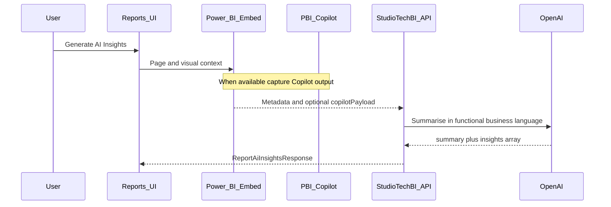

# Report-scoped AI insights (v2)

## Goal

AI in StudioTechBI v2 exists only to help users understand **data on their embedded Power BI report** — not to build models from accounting blobs or match templates.

## Current flow (UI)

1. User opens **Reports** and loads an embedded report.
2. User clicks **Generate AI Insights**.
3. The UI sends context to the backend:
   - `clientCode`, period filters, `activePageName`
   - Visual titles from the active page (`powerBiVisualTitles.ts`)
4. Backend: `POST /api/reports/ai-insights`
5. UI shows summary and bullet insights in a dialog.

## Target flow (exploratory)



### Open questions

- Can embedded Power BI expose Copilot results programmatically (SDK, REST, tenant settings)?
- Licensing and admin enablement per workspace.
- Until Copilot is available, visual titles + page name may remain the primary context.

### Future API field (optional)

```ts
copilotPayload?: unknown; // raw Copilot or export payload when backend supports it
```

Implement on `getAiInsightsForReportPage` request type in `reportService.ts` when the backend contract is ready.
