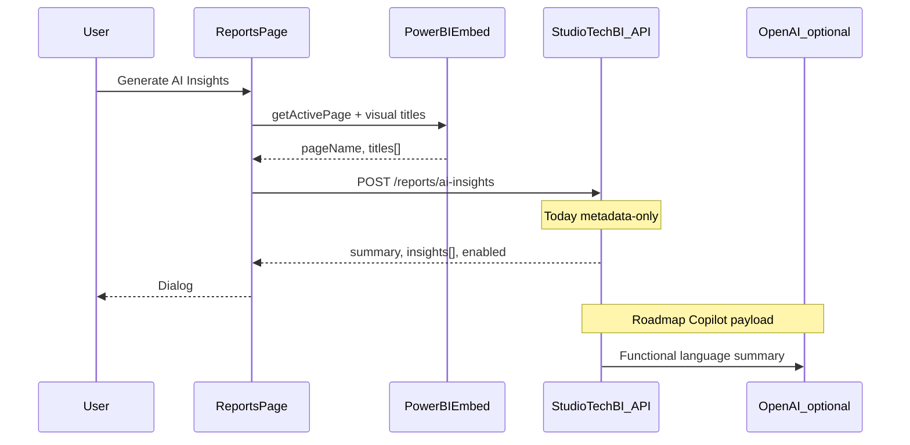

# StudioTechBI UI — Product & Technical Design Document (v2)

**Version:** 2.0  
**Status:** Current production scope (May 2026)  
**Repository:** studiotechbi-ui-main  
**Related:** [AI_REPORT_INSIGHTS.md](./AI_REPORT_INSIGHTS.md), [src/_archived/README.md](../src/_archived/README.md)

---

## Document control

| Version | Summary |
|---------|---------|
| 1.0 | Initial multi-portal BI app with Property, Insights portal, Data Studio, accounting-firm toggles |
| **2.0** | Property and blob/template AI **archived**; AI **report-only**; simplified client UX (dropdown rules, no firm toggles) |

---

## 1. Executive summary

StudioTechBI is a **multi-portal React SPA** for accounting firms and business clients. It delivers **embedded Power BI reporting** with period filtering, dataset refresh, and **AI insights scoped to the active report view**. Platform operators use an **admin portal** for tenants, users, pipelines, and observability.

**v2 deliberately removes** from the active product:

- Property market (Domain) dashboard  
- Standalone Insights portal (blob upload, template matching, canonical plans)  
- Data Studio (semantic model approval)  
- Client top-bar “Accounting firm” switch and Reports/Clients toggle  

Those modules remain in `src/_archived/` for reference and possible restoration.

**v2 AI scope:** Only **Generate AI Insights** on Reports pages, using embedded report context (page, filters, visual titles). Target evolution: Power BI Copilot capture → backend → OpenAI functional summary ([AI_REPORT_INSIGHTS.md](./AI_REPORT_INSIGHTS.md)).

---

## 2. Stakeholders

### 2.1 Stakeholder map

| Stakeholder | Goals | Primary surfaces |
|-------------|-------|------------------|
| **Business client (general)** | View own financial reports; optional AI summary of report | Client portal: Dashboard, Reports, Profile |
| **Business client (accountant-capable)** | View reports for multiple end clients via picker | Client portal: Reports (client dropdown) |
| **Accountant / firm user** | Manage client list; run reports and AI per client | Accountant portal: Clients, Reports |
| **Platform administrator** | Tenants, users, templates, pipeline health | Admin portal |
| **Product / engineering** | Ship v2 scope; integrate with Azure API | This repo + App Service API |
| **Compliance** | Appropriate use of third-party and AI outputs | Disclaimers (archived property); AI messaging on Reports |

### 2.2 Personas (v2)

**P1 — General client (`role: client`, `userType: 0`)**  
- Logs in via Customer tab → `/client/*`  
- Sees **no** client dropdown on Reports; APIs use login `clientCode`  
- May use **Generate AI Insights** if `hasAIInsights` (subscription/API)  

**P2 — Client user with accountant backend profile (`role: client`, `userType: 1` or `isAccountant`)**  
- Still uses **client** portal (Customer login)  
- **Client dropdown** on Reports; `useSelectedClient` on reporting APIs  
- Same AI insights flow as P1, scoped to selected client + report view  

**P3 — Accountant (`role: accountant`)**  
- Logs in via Accountant tab → `/accountant/*`  
- **Client dropdown** always on Reports; Clients page for navigation with `clientCode` state  
- AI insights on accountant Reports page  

**P4 — Platform admin (`role: admin`)**  
- `/admin/login` → operational back-office (unchanged in v2)  

---

## 3. Functional specification (v2)

### 3.1 Public and authentication

| Feature | Route | Behavior |
|---------|-------|----------|
| Landing | `/` | Marketing, subscription tiers (AUD), report-AI preview |
| Login | `/login` | Tabs: Customer → client dashboard; Accountant → accountant dashboard |
| Signup | `/signup` | Registration |
| Admin login | `/admin/login` | Admin-only |

**Session:** JWT in `localStorage`; Bearer on API calls; 401 clears session and redirects to login. Portal access enforced by `user.role` in [`ProtectedRoute`](../src/auth/ProtectedRoute.tsx).

**Login vs backend role:** Navigation after login follows the **login tab**. Route guards use **API `user.role`**. A user with backend `role: accountant` who uses the Customer tab is redirected to the accountant portal when hitting client-only routes.

### 3.2 Client portal (`/client/*`)

| Feature | Route | v2 capabilities |
|---------|-------|-----------------|
| Dashboard | `/client/dashboard` | KPI / charts via portal dashboard APIs |
| **Reports** | `/client/reports` | Power BI embed; period filters; refresh; **Generate AI Insights** |
| Propositions | `/client/propositions` | Placeholder UI (no API yet) |
| Profile | `/client/profile` | Profile display |

**Reports — client picker (v2 rule):**  
Dropdown shown only when `canSelectReportClient(user)` is true:

- `user.role === 'accountant'` → N/A on client portal (user redirected)  
- `user.role === 'client'` **and** (`userType === 1` **or** `isAccountant === true`)  

General clients (`userType: 0`) use a single `clientCode` from login with **no** dropdown.

**Removed in v2 (redirect to Reports):** `/client/property`, `/client/insights`, `/client/data-studio`

### 3.3 Accountant portal (`/accountant/*`)

| Feature | Route | v2 capabilities |
|---------|-------|-----------------|
| Dashboard | `/accountant/dashboard` | Firm-level dashboard |
| Clients | `/accountant/clients` | Client table → navigate to Reports with `clientCode` |
| **Reports** | `/accountant/reports` | Client dropdown; Power BI; refresh; **Generate AI Insights** |

**Reports — client picker:** Shown when `canSelectReportClient(user)` (always true for `role: accountant`).

**Removed in v2 (redirect to Reports):** `/accountant/insights`, `/accountant/data-studio`

### 3.4 Admin portal (`/admin/*`)

Unchanged in v2 scope. Areas include: dashboard, tenants, users, clients, templates, Power BI assets, pipeline, file uploads, dataset refresh, jobs, audit, system health, functional/technical logs, reports, settings.

### 3.5 AI features (v2 — report-only)

| In scope | Out of scope (archived) |
|----------|-------------------------|
| **Generate AI Insights** dialog on client & accountant Reports | Blob sample tables |
| Context: `clientCode`, period, `activePageName`, `visualTitles` | Accounting file upload → template match |
| API: `POST /api/reports/ai-insights` | Canonical dashboard plans |
| Gating: `hasAIInsights` (or `TEMP_FORCE_AI_INSIGHTS_FOR_ALL`) | Data Studio model approval |
| Future: `copilotPayload` on same endpoint | Insights portal navigation |

**User flow:**

1. Load embedded report.  
2. Optionally change period / page.  
3. Click **Generate AI Insights**.  
4. UI collects visual titles from embed ([`powerBiVisualTitles.ts`](../src/portals/client/powerBiVisualTitles.ts)).  
5. Backend returns `summary` + `insights[]` (or `enabled: false`).  

### 3.6 Archived modules (not in v2 product)

See [`src/_archived/README.md`](../src/_archived/README.md):

| Archive path | Former feature |
|--------------|----------------|
| `_archived/property/` | Domain suburb/city/address property dashboard |
| `_archived/features/insights/` | AI Insights portal |
| `_archived/features/modeling-studio/` | Data Studio |

Excluded from TypeScript build and ESLint (`tsconfig.app.json`, `eslint.config.js`).

---

## 4. Technical architecture

### 4.1 Stack

| Layer | Technology |
|-------|------------|
| UI | React 18, TypeScript |
| Build | Vite 5 |
| Routing | React Router v7 (`useRoutes`) |
| Components | MUI v7, MUI X Data Grid |
| Styling | MUI theme + Tailwind (`index.css`) |
| HTTP | Axios (`apiAxiosInstance`, `apiService`) |
| Server state | TanStack React Query (minimal in v2 active app; property hooks archived) |
| Embedded analytics | `powerbi-client` |
| Hosting | Azure Static Web Apps |
| Backend | Azure App Service API (`/api`) |

### 4.2 High-level architecture

```mermaid
flowchart TB
  subgraph users [Users]
    GC[General client]
    AC[Accountant-capable client]
    ACC[Accountant]
    ADM[Admin]
  end

  subgraph ui [StudioTechBI UI v2]
    SPA[React SPA]
    PBI_EMB[PowerBIEmbed]
    AI_DLG[Report AI dialog]
  end

  subgraph api [StudioTechBI API]
    AUTH[Auth]
    RPT[Reports and Power BI]
    DASH[Dashboards]
    ADM_API[Admin ops]
  end

  subgraph external [External]
    PBI[Power BI Service]
    OAI[OpenAI via API roadmap]
  end

  subgraph archive [Not bundled v2]
    ARCH[src/_archived]
  end

  GC --> SPA
  AC --> SPA
  ACC --> SPA
  ADM --> SPA
  SPA --> AUTH
  SPA --> RPT
  SPA --> DASH
  SPA --> ADM_API
  PBI_EMB --> PBI
  AI_DLG --> RPT
  RPT -.-> OAI
  ARCH -.x SPA
```

### 4.3 Repository structure (active)

```
src/
├── main.tsx, App.tsx           # QueryClient, Theme, Router, AuthProvider
├── core/
│   ├── routes.tsx              # Route table + v2 redirects
│   ├── constants.ts            # ROUTES, API_BASE_URL, feature flags
│   ├── types.ts                # User, AuthContextType
│   └── reportClientAccess.ts   # canSelectReportClient()
├── auth/                       # AuthContext, ProtectedRoute
├── layouts/                    # admin | accountant | client
├── portals/                    # Page screens per audience
├── components/                 # Shared (e.g. ReportAreaProgressBar)
├── services/                   # reportService, authService, admin services
├── hooks/                      # Portal dashboards (no property hooks in v2)
└── _archived/                  # Excluded from build — v1 modules
```

### 4.4 Routing and navigation (v2)

Central constants: [`ROUTES`](../src/core/constants.ts).

| Portal | Sidebar (v2) |
|--------|----------------|
| Client | Dashboard, Reports, Propositions, Profile |
| Accountant | Dashboard, Clients, Reports |
| Admin | Full ops menu (unchanged) |

**Legacy URL redirects** (client & accountant children):

- `property`, `insights`, `data-studio` → Reports route for that portal

### 4.5 Authentication and authorization

| Concern | Implementation |
|---------|----------------|
| Login | `POST Auth/login`, `POST Auth/register` |
| Admin login | `POST /admin/login` |
| Token | `localStorage`: `authToken`, `user`, `userRole` |
| User model | `role`, `userType`, `isAccountant`, `clientCode`, `hasAIInsights` |
| Route guard | `allowedRoles` on layout routes |
| Report client picker | `canSelectReportClient(user)` — not a security boundary; API must enforce tenant/client |

**User type mapping (admin-aligned):**

| `userType` | Meaning | Client dropdown on Reports |
|------------|---------|----------------------------|
| `0` | General client | No |
| `1` | Accountant (firm user on client portal) | Yes (if `role: client`) |

`isAccountant` is set from API or derived as `userType === 1` on login ([`authService`](../src/services/authService.ts)).

### 4.6 State management (v2)

| Concern | Pattern |
|---------|---------|
| Session | `AuthContext` |
| Selected report client (client portal) | `ClientViewContext.selectedClientCode` |
| Reports data loading | Local state + `useEffect` in Reports pages |
| Power BI embed | Ref to `Report`; client-side month filters |
| Archived modules | Not imported — no runtime state |

### 4.7 API integration

**Base URL resolution** ([`constants.ts`](../src/core/constants.ts)):

1. `USE_LOCAL_API_IN_DEV` → `http://localhost:5000/api` (dev only)  
2. `VITE_API_BASE_URL` (non-localhost)  
3. `DEFAULT_AZURE_API_BASE_URL`  

**Key v2 endpoints:**

| Domain | Endpoints | Used by |
|--------|-----------|---------|
| Auth | `Auth/login`, `Auth/register`, `/admin/login` | All portals |
| Reports | `/reports/available`, `/reports/available/{clientCode}`, `/reports/accountant-clients`, `/powerbi/embed-token/...`, `/reports/refresh/{clientCode}`, `POST /reports/ai-insights` | Client & accountant Reports |
| Dashboard | User/portal dashboard services | Dashboard pages |
| Admin | Tenants, users, clients, templates, jobs, logs, … | Admin portal |

**Report API client context:**

- General client: `clientCode` from user/config; `useSelectedClient` omitted/false  
- Accountant or accountant-capable client: selected `clientCode`; `useSelectedClient: true` where applicable  

### 4.8 Power BI embedding

[`PowerBIEmbed.tsx`](../src/portals/client/PowerBIEmbed.tsx):

- Fetches embed token from `reportService`  
- Applies `BasicFilter` on configurable month column  
- Emits active page name for AI context  
- [`collectVisualTitlesFromReport`](../src/portals/client/powerBiVisualTitles.ts) for AI payload  

Accountant Reports reuses client embed component.

### 4.9 AI insights pipeline (v2 current + target)



Request shape (extensible): `clientCode`, `reportType`, `period`, `activePageName`, `visualTitles`, optional `copilotPayload`.

---

## 5. Non-functional requirements

| Category | v2 expectation |
|----------|----------------|
| **Performance** | Embed token cached until logout; production build ~1.4MB main chunk (consider code-splitting later) |
| **Security** | HTTPS; Bearer JWT; no secrets in frontend; API authorizes all report/AI calls |
| **Availability** | Depends on Azure API + Power BI |
| **Maintainability** | Archived code isolated; single `canSelectReportClient` for picker rules |
| **Accessibility** | MUI baseline; report dialogs use standard patterns |
| **i18n** | English; AUD on landing |
| **Build** | `src/_archived` excluded from `tsc` and ESLint |

---

## 6. Deployment and operations

| Item | Detail |
|------|--------|
| CI/CD | GitHub Actions → Azure Static Web Apps (`dist/`) |
| Env | `VITE_API_BASE_URL` must target App Service `/api`, not SWA hostname |
| Scripts | `npm run dev`, `build`, `lint`, `typecheck` |
| Feature flag | `TEMP_FORCE_AI_INSIGHTS_FOR_ALL` — set `false` for production subscription gating |

---

## 7. v2 vs v1 comparison

| Area | v1 | v2 |
|------|----|----|
| Property market | Client nav + Domain APIs | Archived |
| Insights portal | Blob, templates, canonical plans | Archived |
| Data Studio | Model approval UI | Archived |
| AI | Multiple surfaces | Reports only |
| Client top bar | Accounting firm switch + Reports/Clients toggle | Removed |
| Client picker | `userType !== 0` | `canSelectReportClient()` (role + userType + isAccountant) |
| Client nav | 7 items | 4 items |

---

## 8. Implementation notes and roadmap

### 8.1 Completed in v2 (UI)

- [x] Archive property, insights, modeling-studio  
- [x] Remove routes/nav; legacy redirects to Reports  
- [x] Landing page aligned to report AI  
- [x] `docs/AI_REPORT_INSIGHTS.md`  
- [x] Remove accounting-firm toggles  
- [x] `canSelectReportClient` for dropdown gating  

### 8.2 Recommended next steps

| Priority | Item |
|----------|------|
| P1 | Set `TEMP_FORCE_AI_INSIGHTS_FOR_ALL = false`; enforce `hasAIInsights` from API |
| P1 | Backend contract for `copilotPayload` / Copilot integration |
| P2 | Propositions API + UI |
| P2 | React Query for Reports loading (consistency) |
| P3 | Code-split Power BI route |
| P3 | httpOnly cookie auth (security hardening) |

### 8.3 Restore archived feature

1. Move folder from `_archived` back to `src/`  
2. Re-add `ROUTES` and sidebar entries  
3. Remove `_archived` from `tsconfig` / ESLint excludes  
4. Coordinate API deployment if needed  

---

## 9. Risks and dependencies

| Risk | Mitigation |
|------|------------|
| API down | Admin system health; user-facing errors via `getEmbedTokenErrorMessage` |
| Wrong client scope | Server validates `clientCode` + `useSelectedClient` |
| AI not enabled per tenant | `enabled: false` in AI response; UI info alert |
| Picker shown incorrectly | `canSelectReportClient` + API `userType` / `isAccountant` consistency |
| Archived code drift | README in `_archived`; do not import from active app |

---

## 10. Appendix — key files (v2)

| Area | Path |
|------|------|
| Routes | `src/core/routes.tsx` |
| Client picker rule | `src/core/reportClientAccess.ts` |
| Config | `src/core/constants.ts` |
| Auth | `src/auth/AuthContext.tsx`, `src/services/authService.ts` |
| Client Reports | `src/portals/client/ReportsPage.tsx` |
| Accountant Reports | `src/portals/accountant/ReportsPage.tsx` |
| Power BI | `src/portals/client/PowerBIEmbed.tsx`, `src/services/reportService.ts` |
| Client context | `src/layouts/client/ClientViewContext.tsx` |
| Archive index | `src/_archived/README.md` |
| AI roadmap | `docs/AI_REPORT_INSIGHTS.md` |
| Deploy | `.github/workflows/azure-static-web-apps-*.yml` |

---

*End of StudioTechBI UI Design Document v2*
